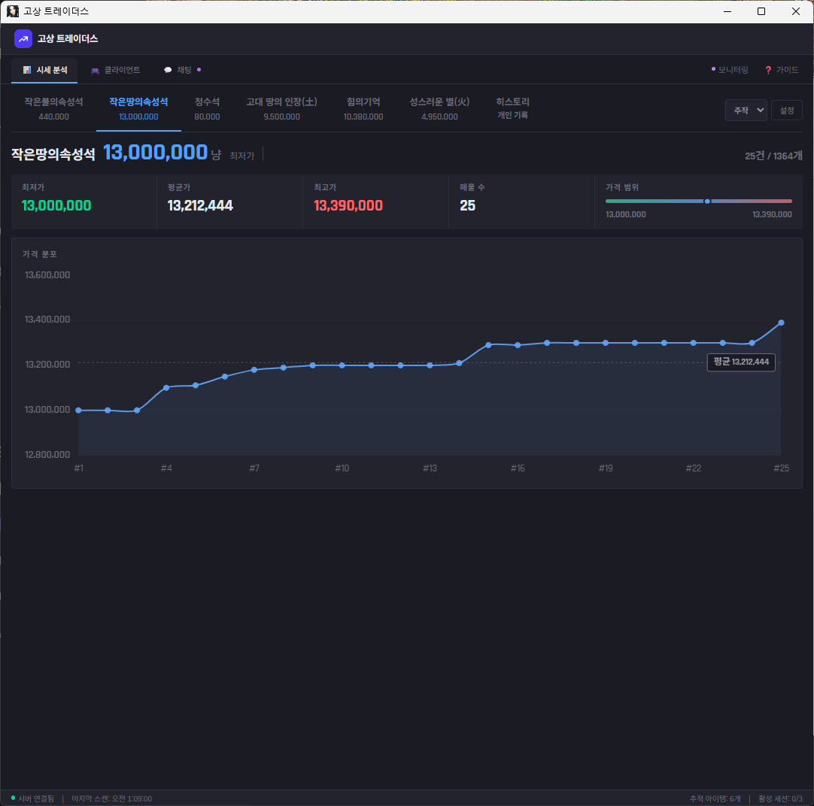
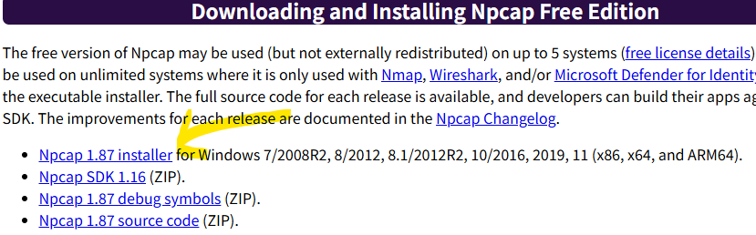

# 고상 트레이더스 (Gersang Traders)

족상인의 현대화된 유틸리티.

**고사아앙 맞기 시르면 복귀해라 고사아아앙**

---

**앱 쓰면서 발생하는 모든 문제는 개인에게 있고 게임사도 저도 아무 책임을 지지 않습니다.**

일단 문제로 보이면 게임사한테 가지 말고 제발 저한테 먼저 욕하세요. 욕받이는 해드림.

허접한 프로그램 써주셔서 항상 감사합니다.

## 다운로드

최신 버전은 [Releases](../../releases) 페이지에서 받을 수 있습니다.

## 설치 및 실행

### 1. Npcap 설치 (필수, 1회)

고상 트레이더스는 **Npcap**이 필요합니다. 설치되어 있지 않으면 전투 측정기가 동작하지 않아요. 안쓰시겠다면 설치 안하셔도 됩니다.

1. [Npcap 공식 사이트](https://npcap.com/#download)에서 최신 설치 파일을 다운로드합니다.

   

2. 설치 시 **"Install Npcap in WinPcap API-compatible Mode"** 옵션을 체크합니다.
3. 설치 완료 후 PC를 재부팅하는 것을 권장합니다.

### 2. 고상 트레이더스 실행

[Releases](../../releases)에서 받은 실행 파일을 관리자 권한으로 실행합니다.
